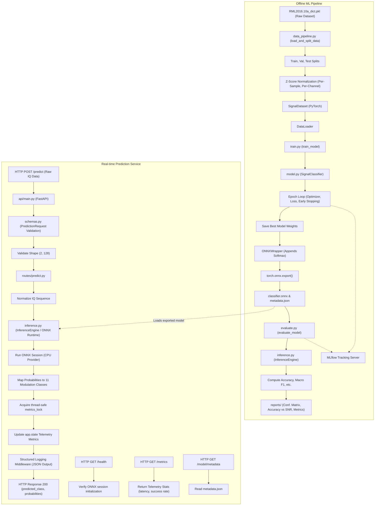

# Signal Modulation Classifier API

An end-to-end Machine Learning pipeline and API service for classifying Radio Frequency (RF) Signal Modulations. The project features offline training using PyTorch, performance evaluation curves, and a real-time web serving endpoint implemented in FastAPI using ONNX Runtime. All metrics and artifacts are tracked dynamically using MLflow.

---

## Table of Contents
1. [Executive Summary](#1-executive-summary)
2. [Technology Stack & Key Libraries](#2-technology-stack--key-libraries)
3. [Architecture & Data Flow](#3-architecture--data-flow)
4. [Directory Structure Visualized](#4-directory-structure-visualized)
5. [File-by-File Analysis](#5-file-by-file-analysis)
6. [Step 1: Local Development Setup](#step-1-local-development-setup)
7. [Step 2: Dataset Verification & Inspection](#step-2-dataset-verification--inspection)
8. [Step 3: Training the Model (Offline Pipeline)](#step-3-training-the-model-offline-pipeline)
9. [Step 4: Evaluating the Model & Logging to MLflow](#step-4-evaluating-the-model--logging-to-mlflow)
10. [Step 5: Launching Dockerized Serving Stack](#step-5-launching-dockerized-serving-stack)
11. [Step 6: Real-Time Serving Verification](#step-6-real-time-serving-verification)
12. [Step 7: Running Unit Tests](#step-7-running-unit-tests)
13. [Troubleshooting & FAQs](#troubleshooting--faqs)
14. [Appendix: MLflow Artifact Proxying & the 'Sticky Path' Trap](#14-appendix-mlflow-artifact-proxying--the-sticky-path-trap)

---

## 1. Executive Summary

This repository implements a complete, self-contained solution for classifying RF signal modulations. It comprises two primary subsystems:
1. **Offline ML Pipeline (`./src/`)**: Handles loading raw RF dataset files, data preprocessing and normalization, training a 1D Convolutional Neural Network (CNN) model using PyTorch, early stopping, and exporting the trained model to ONNX format with supplementary metadata. Additionally, it computes evaluation metrics (accuracy, confusion matrix, accuracy vs. SNR curves) and logs these, along with model parameters, using MLflow.
2. **Real-time Prediction Service (`./api/`)**: A FastAPI web server that loads the exported ONNX model into memory via ONNX Runtime (`onnxruntime`) to perform high-frequency, low-latency predictions on raw In-phase and Quadrature (IQ) signals. The API tracks and exposes structured logs and telemetry metrics (latency, success rates, uptime).

---

## 2. Technology Stack & Key Libraries

- **Deep Learning Framework**: [PyTorch](https://pytorch.org/) (Model construction, training, optimization)
- **Model Compilation & Inference Engine**: [ONNX Runtime](https://onnxruntime.ai/) (Execution of model predictions on CPU)
- **Web API Framework**: [FastAPI](https://fastapi.tiangolo.com/) & [Uvicorn](https://www.uvicorn.org/) (High-performance web server)
- **Data Validation & Settings**: [Pydantic](https://docs.pydantic.dev/) & `pydantic-settings` (Type safety, parsing, environment config)
- **Experiment Tracking**: [MLflow](https://mlflow.org/) (Metric, parameter, and artifact logging)
- **Scientific Computing & Plotting**: [NumPy](https://numpy.org/), [scikit-learn](https://scikit-learn.org/), [Matplotlib](https://matplotlib.org/) (Data splitting, evaluation metrics, visual plotting)
- **Containerization**: [Docker](https://www.docker.com/) & [Docker Compose](https://docs.docker.com/compose/) (Deployment orchestration)

---

## 3. Architecture & Data Flow

Data is processed identically in training and inference via a mathematical normalization convention (z-score normalization along the time dimension). Offline workloads (Training and Evaluation) are decoupled from Online serving workloads. The Serving layer depends only on the ONNX model artifact, keeping the API lightweight and independent of the deep learning framework.

Below is the workflow diagram showing both the **Offline Pipeline** and the **Online API** workflows:



---

## 4. Directory Structure Visualized

```
signal-classifier-API/
├── .github/
│   └── workflows/
│       └── ci.yml              # CI workflow configuration
├── api/                        # FastAPI application source
│   ├── routes/                 # FastAPI routes / endpoint handlers
│   │   ├── __init__.py
│   │   ├── health.py           # /health status check
│   │   ├── metadata.py         # /model/metadata handler
│   │   ├── metrics.py          # /metrics telemetry reporting
│   │   └── predict.py          # /predict post-request inference handler
│   ├── __init__.py
│   ├── config.py               # Settings loader (Pydantic Settings)
│   ├── main.py                 # FastAPI application initializer and lifespan manager
│   ├── middleware.py           # Structured JSON log formatter and latency logging
│   └── schemas.py              # Pydantic schemas (Request, Response, Validation)
├── src/                        # Machine learning library code
│   ├── __init__.py
│   ├── data_pipeline.py        # Loading, splitting, and normalization pipeline
│   ├── evaluate.py             # Performance measurement and plotting pipeline
│   ├── inference.py            # ONNX Runtime InferenceEngine wrapper
│   ├── model.py                # 1D Convolutional Neural Network definition
│   └── train.py                # PyTorch training module, ONNX export, MLflow logger
├── tests/                      # Python pytest testing package
│   ├── fixtures/               # Test fixtures
│   │   ├── metadata.json       # Mock metadata.json for testing
│   │   └── test_model.onnx     # Small mock ONNX model for testing
│   ├── conftest.py             # Test config (sets test model environment variables)
│   ├── test_config.py          # Settings validation tests
│   ├── test_data_pipeline.py   # Unit tests for data pipeline and split ratios
│   ├── test_evaluate.py        # Unit tests for evaluate module metrics
│   ├── test_health.py          # Unit tests for health endpoint validation
│   ├── test_inference.py       # Unit tests for InferenceEngine ONNX execution
│   ├── test_logging.py         # Unit tests for structured logging
│   ├── test_metadata.py        # Unit tests for metadata endpoint validation
│   ├── test_metrics.py         # Unit tests for telemetry tracking & thread safety
│   ├── test_model.py           # Unit tests for 1D CNN architecture
│   ├── test_predict.py         # Unit tests for /predict shapes validation
│   └── test_train.py           # Unit tests for model training & export
├── .env.example                # Example template for environment variables configuration
├── .gitignore                  # Git untracked files specification
├── Dockerfile                  # Multi-stage production container definition
├── LICENSE                     # MIT License specification
├── docker-compose.yml          # Multi-container compose definition (API + MLflow)
├── pyproject.toml              # Build system, pytest, ruff, and mypy configs
├── requirements-dev.txt        # Development dependencies
└── requirements.txt            # System dependencies
```

---

## 5. File-by-File Analysis

### 5.1. Deep Learning & Inference Core (`./src/`)

#### 5.1.1. `data_pipeline.py`
- **Role**: Loads, splits, and normalizes raw signal data.
- **Key Variables**:
  - `MODULATION_CLASSES`: Canonical order of the 11 supported modulation classes: `["8PSK", "AM-DSB", "AM-SSB", "BPSK", "CPFSK", "GFSK", "PAM4", "QAM16", "QAM64", "QPSK", "WBFM"]`.
- **Key Functions / Classes**:
  - `load_and_split_data(...)`: Loads the raw pickle dataset. Performs stratified splitting (train/val/test splits, defaulted to `0.7 / 0.15 / 0.15`). Splitting is stratified across both the Modulation Classes and the Signal-to-Noise Ratios (SNRs) to prevent sample distribution shift.
  - `combine_and_normalize(...)` *(internal helper)*: Normalizes IQ signals per-sample and per-channel independently using standard score normalization ($z = \frac{x - \mu}{\sigma + \epsilon}$ where $\epsilon = 1\text{e-}10$) along the 128 time-step dimension. This aligns all signals to have a mean of 0 and a standard deviation of 1.
  - `SignalDataset(Dataset)`: A standard PyTorch `Dataset` wrapper that converts NumPy array data splits into PyTorch Float and Long tensors.

#### 5.1.2. `model.py`
- **Role**: Model architecture definition.
- **Key Functions / Classes**:
  - `SignalClassifier(nn.Module)`: A 1D Convolutional Neural Network containing 3 distinct Conv1D blocks:
    - **Block 1**: Conv1d (2 $\to$ 64 channels, kernel size=3, padding=1) $\to$ BatchNorm1d $\to$ ReLU $\to$ MaxPool1d (kernel=2, stride=2).
    - **Block 2**: Conv1d (64 $\to$ 128 channels, kernel size=3, padding=1) $\to$ BatchNorm1d $\to$ ReLU $\to$ MaxPool1d (kernel=2, stride=2).
    - **Block 3**: Conv1d (128 $\to$ 256 channels, kernel size=3, padding=1) $\to$ BatchNorm1d $\to$ ReLU $\to$ MaxPool1d (kernel=2, stride=2).
    - **Global Pooling**: AdaptiveAvgPool1d(1) (collapses remaining time dimension to 1).
    - **Classification Head**: Dropout (p=0.5) $\to$ Linear layer (256 $\to$ 11 classes).
- **Forward Pass**: Accepts input tensor of shape `(batch_size, 2, 128)` and returns unnormalized logits of shape `(batch_size, 11)`.

#### 5.1.3. `train.py`
- **Role**: Training loop orchestrator, early stopping controller, and model exporter.
- **Key Functions / Classes**:
  - `ONNXWrapper(nn.Module)`: Wraps the `SignalClassifier` to append a `Softmax(dim=1)` layer to the logits. This ensures that the exported ONNX model directly outputs probability distributions.
  - `train_model(...)`: Runs the full training sequence:
    1. Sets random seeds for PyTorch and CUDA.
    2. Sets up MLflow tracking (run/experiment creation).
    3. Triggers dataloader preparation.
    4. Trains using standard `Adam` optimizer and `CrossEntropyLoss` criterion.
    5. Implements early stopping based on validation loss progression (patience parameter).
    6. Restores the weights of the best validation epoch.
    7. Evaluates the best model on the test dataset.
    8. Exports the model to `model.onnx` using `torch.onnx.export`.
    9. Generates a helper `metadata.json` documenting metadata like target labels, input shape, date of training, and best accuracy.
    10. Initiates an automated post-training evaluation via `evaluate_model(...)`.
  - `main()`: Command Line Interface (CLI) entry point parsing training arguments (epochs, batch size, learning rate, paths).

#### 5.1.4. `evaluate.py`
- **Role**: Evaluates the compiled ONNX model against the held-out test data.
- **Key Functions / Classes**:
  - `_compute_metrics(...)`: Computes overall accuracy, macro-precision, macro-recall, macro-F1, and per-class metrics.
  - `_save_local_reports(...)`: Saves local files inside the `reports/` folder:
    - `classification_report.txt`: Tabulated precision, recall, and F1 scores per class.
    - `confusion_matrix.png`: Heatmap plot highlighting classification confusions.
    - `snr_vs_accuracy.png`: Accuracy curve plotted across discrete SNR decibel thresholds.
  - `_log_mlflow_run(...)`: Connects to the active MLflow tracking URI, updating metrics and uploading the text report and PNG plots as artifacts under the training run.
  - `evaluate_model(...)`: Execution wrapper initializing the `InferenceEngine` wrapper, performing inferences on the test split, computing all performance stats, generating local reports/plots, and logging them to MLflow.

#### 5.1.5. `inference.py`
- **Role**: Runs local inferences using ONNX Runtime.
- **Key Functions / Classes**:
  - `InferenceEngine`: Lightweight wrapper handling inputs and execution on ONNX models:
    - `__init__(model_path)`: Loads the target ONNX model and initializes an `ort.InferenceSession` pointing to the CPU execution provider (`CPUExecutionProvider`). Retrieves dynamic input and output shape keys.
    - `predict(iq_data)`: Validates that data type is float32, performs identical per-sample and per-channel z-score normalization along axis 2 (time steps) to ensure mathematical alignment with model training weights, and evaluates the normalized data through the session. Returns classification probabilities of shape `(batch_size, 11)`.

---

### 5.2. Web Server & Serve API (`./api/`)

#### 5.2.1. `config.py`
- **Role**: Defines Pydantic configuration settings.
- **Key Functions / Classes**:
  - `Settings(BaseSettings)`: Configures configurations for `app_name`, `host` (default `0.0.0.0`), `port` (default `8000`), and `model_path` (default `models/classifier.onnx`).
  - Reads variables from `.env` dynamically with the environment prefix `SC_` (e.g., `SC_PORT=8000`).

#### 5.2.2. `main.py`
- **Role**: Entry point initializing the FastAPI app and setting up configuration routes.
- **Key Functions / Classes**:
  - `lifespan(app)`: Async context manager defining lifespan events. On startup, it instantiates the system-wide `InferenceEngine` loader, storing it in `app.state.inference_engine`.
  - Configures Structured JSON logging globally via `setup_logging()`.
  - Attaches telemetry state parameters (uptime tracker, total predictions, failed predictions, and min/max/average inference execution times) directly onto `app.state`.
  - Includes routes: `/health`, `/model/metadata`, `/predict`, and `/metrics`.

#### 5.2.3. `middleware.py`
- **Role**: Telemetry reporting and structured log format parsing.
- **Key Functions / Classes**:
  - `JSONFormatter(logging.Formatter)`: Converts server logs into structured JSON strings containing key parameters (e.g., timestamp, log level, logger name, message).
  - `StructuredLoggingMiddleware(BaseHTTPMiddleware)`: Intercepts all incoming API calls, measures execution latency using high-resolution performance counters (`time.perf_counter`), and outputs a structured log line containing the HTTP method, request path, response status code, and latency in milliseconds.
  - `setup_logging()`: Registers standard stream handlers pointing to `stdout` utilizing the custom `JSONFormatter` to keep output standardized.

#### 5.2.4. `schemas.py`
- **Role**: Defines data contracts, serialization, and input validations.
- **Key Functions / Classes**:
  - `ModelMetadataResponse`: Model output format for metadata endpoint.
  - `PredictionRequest`: Formats predictions input payload. Uses a `@field_validator` classmethod (`validate_iq_data_shape`) verifying that the input matrix is precisely of shape `(2, 128)` and checks that all values are numeric.
  - `PredictionResponse`: Standard output format mapping the predicted class and the full dictionary of class-wise confidence probabilities.
  - `PredictionMetrics`: Exposes telemetry information on uptime, request counts, failures, and execution speed statistics.

---

### 5.3. Router Endpoints (`./api/routes/`)

#### 5.3.1. `health.py`
- **Role**: Handles `/health` requests to verify API server status.
- **Handler**:
  - `health_check(...)`: Measures server uptime. Lazily attempts model loading if not present. Confirms that the `InferenceEngine` is correctly initialized with an active ONNX Runtime session. If not, returns an `HTTP 503 Service Unavailable` status code.

#### 5.3.2. `metadata.py`
- **Role**: Handles `/model/metadata` requests.
- **Handler**:
  - `get_model_metadata()`: Reads `metadata.json` located relative to the active `classifier.onnx` file path. Exposes training date, framework parameters, and accuracy records. Throws `HTTP 404` if the file doesn't exist.

#### 5.3.3. `metrics.py`
- **Role**: Handles `/metrics` requests.
- **Handler**:
  - `get_metrics(...)`: Computes current uptime and extracts telemetry variables (total predictions, failures, min/max/average latencies) stored in the application's global state (`app.state`).

#### 5.3.4. `predict.py`
- **Role**: Serves the core ML inference POST request `/predict`.
- **Key Variables**:
  - `metrics_lock`: A standard `threading.Lock` used to synchronize state updates. Since FastAPI executes synchronous handlers (`def predict`) in a threadpool, multiple concurrent requests can cause race conditions when updating `app.state` telemetry. The lock ensures safe telemetry mutations.
- **Handler**:
  - `predict(...)`: Converts `PredictionRequest.iq_data` into a batched NumPy array, runs ONNX inference, computes latency, and uses `metrics_lock` to thread-safely update telemetry statistics.

---

## 6. Step 1: Local Development Setup

Set up a virtual environment and install dependencies on your local machine.

### Windows (PowerShell)
```powershell
# 1. Create the virtual environment
python -m venv .venv

# 2. Activate the virtual environment
.venv\Scripts\Activate.ps1

# 3. Upgrade pip
python -m pip install --upgrade pip

# 4. Install serving and development dependencies
python -m pip install -r requirements-dev.txt
```

### Linux / macOS (Bash)
```bash
# 1. Create the virtual environment
python3 -m venv .venv

# 2. Activate the virtual environment
source .venv/bin/activate

# 3. Upgrade pip
python3 -m pip install --upgrade pip

# 4. Install serving and development dependencies
python3 -m pip install -r requirements-dev.txt
```

---

## 7. Step 2: Dataset Verification & Inspection

Before starting training, you can verify the raw dataset file structure by opening a Python interactive shell or running a short inspection script locally:

```python
import pickle
from pathlib import Path

# Load the dataset pickle
dataset_path = Path("data/raw/RML2016.10a_dict.pkl")
with dataset_path.open("rb") as f:
    # RML2016.10a uses latin1/bytes encoding
    data = pickle.load(f, encoding="latin1")

# Inspect keys and dictionary shapes
keys = list(data.keys())
print(f"Total key combinations (Class, SNR): {len(keys)}")
print(f"Sample key format: {keys[0]}")
print(f"Signal array shape per key: {data[keys[0]].shape}")
```

### Behind the Scenes:
To understand the dataset simply, think of it as a dictionary where the keys are specific signal conditions, and the values are the actual recorded signals.

1. **How the Data is Keyed**:
   - The dataset dictionary uses keys that are tuples of `(Modulation Class, SNR)`. For example, the key `('QPSK', 2)` represents QPSK-modulated signals recorded at a Signal-to-Noise Ratio (SNR) of +2 dB.
   - Since there are **11 modulation classes** and **20 SNR levels**, there are exactly $11 \times 20 = 220$ unique key combinations in the dataset.

2. **The Components Explained**:
   - **Modulation Class**: This refers to the specific technique used to encode digital data onto a radio carrier wave (analogous to standard FM vs. AM radio, or different Wi-Fi/Bluetooth protocols). There are 11 formats in this dataset: `8PSK`, `AM-DSB`, `AM-SSB`, `BPSK`, `CPFSK`, `GFSK`, `PAM4`, `QAM16`, `QAM64`, `QPSK`, and `WBFM`.
   - **Signal-to-Noise Ratio (SNR)**: This measures the quality of the signal compared to background noise.
     - **High SNR** (like `+18 dB`): The signal is very strong and clear, with very little static noise. Easy for the model to classify.
     - **Low SNR** (like `-20 dB`): The signal is buried under heavy static noise. Very difficult for the model to classify, as the waveform looks like pure noise.
     - The dataset includes 20 discrete levels from `-20 dB` to `+18 dB` in steps of 2 dB.

3. **Dimensions of the Signal Arrays**:
   - For each of the 220 key combinations, the dictionary holds a numpy array of shape `(1000, 2, 128)`:
     - **`1000`**: The number of independent signal recordings (samples) captured under these specific conditions.
     - **`2`**: The signal channels. In radio frequency communication, waveforms are represented mathematically using two components: the **In-phase (I)** component and the **Quadrature (Q)** component. This is similar to tracking coordinates $(x, y)$ of a moving point.
     - **`128`**: The number of sequential time-steps (time points) captured for each recording.
   - **Total Dataset Size**: $220 \text{ combinations} \times 1,000 \text{ samples} = 220,000$ total signal samples.

---

## 8. Step 3: Training the Model (Offline Pipeline)

To train the 1D CNN model from scratch and export it to ONNX, run the training module.

### Windows (PowerShell)
```powershell
$env:PYTHONPATH="."
$env:PYTHONUTF8="1"
.venv\Scripts\python src/train.py --epochs 20 --batch-size 128 --lr 0.001
```

### Linux / macOS (Bash)
```bash
PYTHONPATH="." python3 src/train.py --epochs 20 --batch-size 128 --lr 0.001
```

### Behind the Scenes:
1. **Data Preprocessing & Normalization**:
   - The script loads the pickle file.
   - It performs a stratified split (70% train, 15% val, 15% test) to ensure consistent distribution of modulation categories and SNR levels across splits.
   - It performs **z-score normalization** on the fly along the time steps dimension (axis 2) independently per-sample and per-channel:
     $$z = \frac{x - \mu}{\sigma + 1\text{e-}10}$$
     This scaling prevents signal amplitude differences from affecting the network.
2. **CNN Architecture**:
   - **Block 1**: 2 input channels -> 64 output channels (Conv1D kernel=3, padding=1) -> Batch Norm -> ReLU -> MaxPool (stride=2).
   - **Block 2**: 64 channels -> 128 channels (Conv1D kernel=3, padding=1) -> Batch Norm -> ReLU -> MaxPool (stride=2).
   - **Block 3**: 128 channels -> 256 channels (Conv1D kernel=3, padding=1) -> Batch Norm -> ReLU -> MaxPool (stride=2).
   - **Global Avg Pool**: Squeezes the remaining time steps dimension using `AdaptiveAvgPool1d(1)` into a 256-dimensional feature vector.
   - **Classification Head**: Dropout (p=0.5) -> Linear layer outputting 11 logits.
3. **Training & Early Stopping**:
   - The loop runs for up to 20 epochs using the `Adam` optimizer and `CrossEntropyLoss`.
   - If the validation loss does not improve for 5 consecutive epochs (`patience=5`), early stopping terminates the loop and restores the best epoch's weights.
4. **ONNX Compiler Export**:
   - The model checkpoint is wrapped by `ONNXWrapper` which appends a `Softmax(dim=1)` layer to logits.
   - This ensures the model outputs probability distributions directly.
   - It exports the model to `models/model.onnx` and copies it to `models/classifier.onnx` for API deployment, alongside a metadata JSON containing label details.

---

## 9. Step 4: Evaluating the Model & Logging to MLflow

Once training is complete, run the evaluation script to calculate classification reports and SNR-vs-Accuracy performance metrics, and upload them to the running MLflow tracking server.

> **Note**: Start the Docker Compose stack (Step 5) first so the MLflow tracking server is active at `http://localhost:5000`.

### Windows (PowerShell)
```powershell
$env:PYTHONPATH="."
$env:PYTHONUTF8="1"
$env:MLFLOW_TRACKING_URI="http://localhost:5000"
.venv\Scripts\python src/evaluate.py --model-path models/classifier.onnx --data-path data/raw/RML2016.10a_dict.pkl
```

### Linux / macOS (Bash)
```bash
PYTHONPATH="." MLFLOW_TRACKING_URI="http://localhost:5000" python3 src/evaluate.py --model-path models/classifier.onnx --data-path data/raw/RML2016.10a_dict.pkl
```

### Behind the Scenes:
1. **Model Load & Prediction**:
   - The script initializes `InferenceEngine` to load `models/classifier.onnx` using ONNX Runtime.
   - It executes predictions on the 33,000 test set samples.
2. **Metrics Computation**:
   - Generates overall accuracy, precision, recall, and F1-scores.
   - Plots a confusion matrix heatmap highlighting class confusions.
   - Calculates accuracy at individual SNR levels and plots an Accuracy-vs-SNR curve.
3. **Remote Proxy Artifact Logging**:
   - The client connects to `http://localhost:5000`.
   - Because the server is configured to act as an artifact proxy, the client uploads the metrics and plot images via standard HTTP requests to the server's API.
   - The server receives the files and saves them inside its container storage, keeping your local host filesystem clean.

---

## 10. Step 5: Launching Dockerized Serving Stack

Build and start the web server container and MLflow tracking server using Docker Compose.

```bash
docker compose up --build -d
```

### Behind the Scenes:
* **`api` service**: Builds a python container, copies `api/` and `src/` code inside `/app`, mounts `./models` to expose the trained `classifier.onnx` model, and runs FastAPI serving at `http://localhost:8000`.
* **`mlflow` service**: Boots the MLflow tracking server container at `http://localhost:5000` using the sqlite database `/mlflow/mlflow.db`. 
  - To prevent directory path mismatches between the host and container filesystems, we start the server with the `--serve-artifacts` and `--artifacts-destination /mlflow/artifacts` flags. This configures the container to act as an HTTP proxy.

---

## 11. Step 6: Real-Time Serving Verification

Once the Docker stack is running, you can test the prediction endpoint `/predict` by sending a JSON payload containing a dummy signal of shape `(2, 128)`.

### Option A: Using cURL
```bash
curl -X POST "http://localhost:8000/predict" \
     -H "Content-Type: application/json" \
     -d '{"iq_data": [[0.1]*128, [-0.1]*128]}'
```

### Option B: Using a Python Script
You can verify the running endpoints using a simple requests client:
```python
import requests
import json

base_url = "http://localhost:8000"

# 1. Verify health status
health = requests.get(f"{base_url}/health").json()
print("Health status:", health)

# 2. Verify model metadata
metadata = requests.get(f"{base_url}/model/metadata").json()
print("Model classes:", metadata["classes"])

# 3. Call prediction endpoint with dummy signal
dummy_iq = [[0.1] * 128, [-0.1] * 128]
response = requests.post(f"{base_url}/predict", json={"iq_data": dummy_iq}).json()
print("Prediction response:", json.dumps(response, indent=2))
```

### Available Endpoints & browser URLs:
- **FastAPI Interactive Docs**: [http://localhost:8000/docs](http://localhost:8000/docs)
  Expand `/predict` and send a test payload (shape `2, 128`) to check the classification probabilities.
- **MLflow Tracking Dashboard**: [http://localhost:5000](http://localhost:5000)
  Refresh the page to view the `Signal_Classifier` experiment and inspect the logged parameters, confusion matrix, and accuracy plots under the artifacts tab.
- **FastAPI Health status**: [http://localhost:8000/health](http://localhost:8000/health)
  Returns server uptime and verifies if the ONNX model is correctly loaded in memory.
- **Model Metadata**: [http://localhost:8000/model/metadata](http://localhost:8000/model/metadata)
  Exposes the framework details, output categories, and training validation accuracy metrics.
- **Telemetry Metrics**: [http://localhost:8000/metrics](http://localhost:8000/metrics)
  Exposes thread-safe stats on uptime, total requests, failed calls, and min/max/average execution latencies.

### Behind the Scenes:
FastAPI handles requests concurrently in a shared threadpool. To prevent race conditions from concurrent calls modifying telemetry stats on `app.state`, the `/predict` route utilizes a mutual exclusion lock (`threading.Lock`). Latencies are computed using high-resolution performance counters (`time.perf_counter`) and exclude failed requests to prevent skewing performance reports.

---

## 12. Step 7: Running Unit Tests

Run the test suite using `pytest` to verify the code logic and configuration validators.

### Windows (PowerShell)
```powershell
$env:PYTHONPATH="."
$env:PYTHONUTF8="1"
.venv\Scripts\python -m pytest
```

### Linux / macOS (Bash)
```bash
PYTHONPATH="." python3 -m pytest
```

---

## 13. Troubleshooting & FAQs

#### Q: The MLflow runs appear, but the Artifacts tab is empty.
**A**: Ensure you restarted the Docker Compose container after configuring `--serve-artifacts` and deleted the old named volume (e.g. `docker compose down -v` followed by `docker compose up -d`). MLflow stores experiment paths permanently in its database on creation; starting with a fresh volume ensures the experiment gets registered with the correct proxied `mlflow-artifacts:/` location instead of a local file path.

#### Q: I get `HTTP 422 Unprocessable Entity` when calling `/predict`.
**A**: FastAPI enforces input shapes. Make sure the input array contains exactly 2 channels (I & Q) and 128 sequence steps (shape `(2, 128)`). Values must be numeric floats.

#### Q: How does model loading work on startup?
**A**: The FastAPI application uses an `asynccontextmanager` lifespan handler in `api/main.py`. Upon startup, it instantiates `InferenceEngine` with the path configured in your `.env` (or config settings). If the ONNX file is not found, the server log outputs structured JSON errors and the `/health` endpoint will report `model_loaded: false` and return `HTTP 503 Service Unavailable`.

---

## 14. Appendix: MLflow Artifact Proxying & the 'Sticky Path' Trap

When running an MLflow tracking server inside a Docker container while running the client scripts (training/evaluation) on the host machine, you will encounter a filesystem mismatch by default. Here is how we solved it:

### 1. The File Mismatch Problem
By default, an MLflow server tells the client to write artifacts directly to a local filesystem path (like `/mlflow/artifacts`). Because the training/evaluation client runs on the host Windows machine, it interprets `/mlflow/artifacts` relative to the current drive root (creating a directory named `\mlflow\artifacts` at the root of the active drive, which is outside the project workspace on the host) and fails to upload them to the container's storage, resulting in an empty **Artifacts** tab.

### 2. The Fix: HTTP Artifact Proxying
By adding the `--serve-artifacts` and `--artifacts-destination /mlflow/artifacts` flags to the `mlflow server` command in `docker-compose.yml`, we configure the server to act as an HTTP proxy. Instead of telling the client to write directly to a local folder, the server instructs the client to stream the files over HTTP using the `mlflow-artifacts:/` URI scheme. The server then receives the upload and saves it inside the container's volume.

### 3. The "Sticky Path" Database Trap (Crucial Gotcha)
MLflow permanently registers an experiment's artifact location in its metadata database (SQLite `mlflow.db`) **at the exact moment the experiment is created**.
* If you run your client *before* enabling the proxy, the experiment `Signal_Classifier` gets registered in the database with the local path `/mlflow/artifacts/1`.
* Even if you restart the server with the `--serve-artifacts` proxy flags enabled, the server reads the database, sees the old registered path `/mlflow/artifacts/1`, and still tells the client to upload to that path directly (bypassing the proxy).
* **Resolution**: To apply the proxy settings, you must wipe the old database volume (`docker compose down -v`) and restart. This allows the experiment to be created fresh, registering its path as `mlflow-artifacts:/1`, which forces the client to use the HTTP proxy upload and successfully displays the plots in the UI.